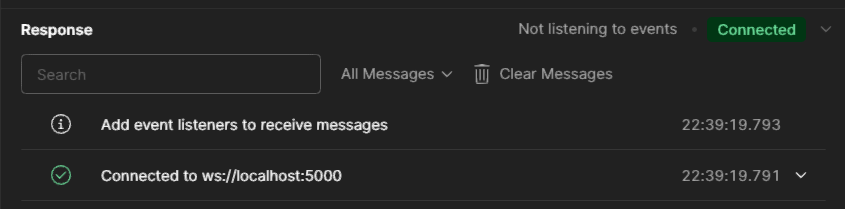
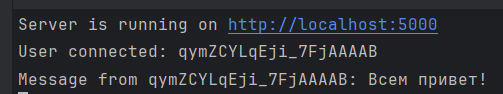

## Запуск сервера
Необходимо запускать `server.ts`, если сервер запустился успешно, то в консоли появится сообщение **"Server is running on http://localhost:5000"**

## Проверка GET-запросов
В Postman создаем новый запрос (вид **HTTP**) и проверяем следующие запросы:
1. http://localhost:5000/api/posts/ - получение всех постов
2. http://localhost:5000/api/posts/1 - получение поста с id = 1

## Проверка работы WebSocket
В Postman создаем новый запрос (вид **Socket.io**):
1. Подключаемся по адресу [ws://localhost:5000](ws://localhost:5000), если все успешно, то в консоли появится сообщение **"User connected: \<user-id\>"**
2. На вкладке Message может написать какое-либо сообщение и отправить его, если все успешно, то в консоли появится сообщение **"Message from \<user-id\>:\<msg\>"**

## Визуальный пример

